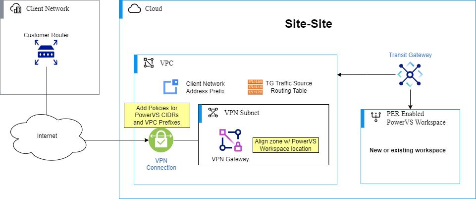
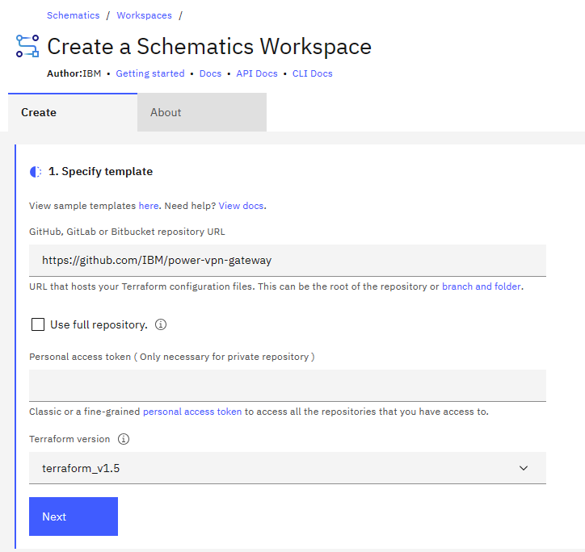
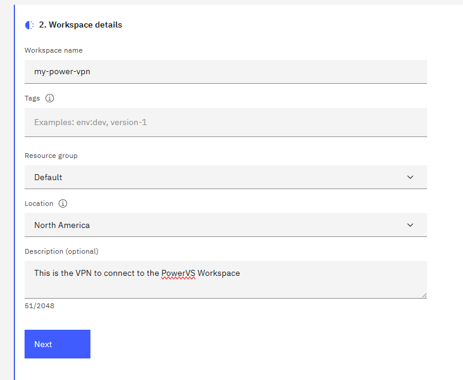
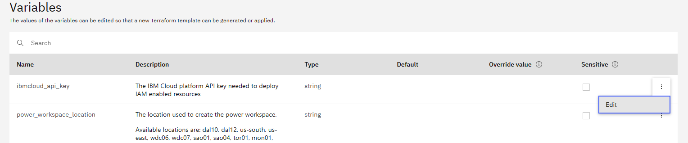
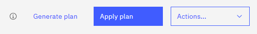
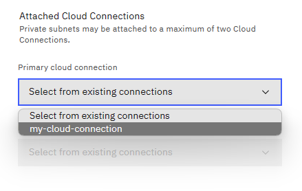

# PowerVPN Site to Site

## Overview

This Terraform module will create a VPC VPN Gateway and attach it to a new or existing PowerVS
Workspace. Providing secure access to IBM Cloud Power infrastructure.

This Terraform module deploys the following infrastructure:

- VPC
- VPC Subnet
- VPC Security Groups
- VPC VPN Gateway
- PowerVS Workspace (Optional)
- Transit Gateway (Optional)
- Cloud Connection w/DirectLink* (Optional)

\* Only in locations without
[Power Edge Routers](https://cloud.ibm.com/docs/power-iaas?topic=power-iaas-per)

### Deployment Model

## Setup Requirements

### Prerequisites

#### Upgrading your IBM Cloud Account

To order and use IBM Cloud services, billing information is required for your account. See
[Upgrading Your Account](https://cloud.ibm.com/docs/account?topic=account-upgrading-account).

#### Install Terraform

If you wish to run Terraform locally, see
[Install Terraform](https://learn.hashicorp.com/tutorials/terraform/install-cli#install-terraform).

#### IBM Cloud API Key

You must supply an IBM Cloud API key so that Terraform can connect to the IBM Cloud Terraform
provider. See
[Create API Key](https://cloud.ibm.com/docs/account?topic=account-userapikey&interface=ui#create_user_key).

#### Network Planning

This automation will require some network planning before deploying. You will need to know the IP
space you plan to use (or are using) for your PowerVS Workspace and which parts of your on-prem
network you wish to be routable. These will be specified using the `power_cidrs` and `client_cidrs`
variables respectively. You do not have to know the exact subnets you plan to use, but rather pick a
CIDR(s) that will encompass them.

Please be careful to not pick an IP space for the PowerVS Workspace that could conflict with
internal IBM IPs. These include `10.0.0.0/14`, `10.200.0.0/14`, `10.198.0.0/15`, and `10.254.0.0/16`.
Otherwise, they may not be routed through the VPN. See
[Power Subnet Configuration](https://cloud.ibm.com/docs/power-iaas?topic=power-iaas-configuring-subnet#cidr-notation)
for more information. You also must avoid using the same IP space as the VPN gateway is configured
to use. By default this is `10.134.0.0/28`, but can be changed by specifying the optional variable
`vpn_subnet_cidr`.

### Deployment

#### Terraform CLI

You may choose to use the Terraform command line to deploy this module. You can download terraform here:
[Install Terraform](https://developer.hashicorp.com/terraform/install). Once installed, run
`terraform init` and then `terraform apply` to create the VPN. When you run apply, terraform will
prompt you for the required variables.

If you need to specify any of the optional variables, you can do so by exporting the variable using
the prefix `TF_VAR_`, using a `.tfvars` file, or by passing them as an option to the terraform
command using `-var`. For more information see
[Assigning Values to Root Module Variables](https://developer.hashicorp.com/terraform/language/values/variables#assigning-values-to-root-module-variables).

#### IBM Schematics

Schematics is an IBM Cloud service, that delivers Infrastructure as Code (IaC) tools as a service.
You can use the capabilities of Schematics to consistently deploy and manage your cloud
infrastructure environments. From a single pane of glass, you can run end-to-end automation to build
one or more stacks of cloud resources, manage their lifecycle, manage changes in their
configurations, deploy your app workloads, and perform day-2 operations.

To create a VPN with Schematics,
first [create a workspace](https://cloud.ibm.com/schematics/workspaces/create). Specify this
repository for the repository URL and set the Terraform version to 1.5 or greater. Click Next, and then
give the workspace a name and any other details you'd like. You may choose to use any Resource Group
or Location.

| Specify Template | Workspace Details |
|---|---|
|||

Once your Workspace is created. Use the Variables section below the Details section on the Settings
page to configure the VPN. You will need to edit and specify every variable that has a description
not starting with "Optional variable". If needed also specify any variables that are optional.

After setting the variables, you may use the "Apply plan" button at the top of the page to deploy the VPN.

### Post Deployment

#### PowerVS Locations using a Cloud Connection

If the PowerVS Workspace location you choose does not have a Power Edge Router (See
[Getting started with the Power Edge Router](https://cloud.ibm.com/docs/power-iaas?topic=power-iaas-per)
), you will need to take an additional step when creating subnets in that Workspace. For subnets in
these locations to be routed through the VPN you will need to attach the Cloud Connection that was
created by this automation. This option is found in the same UI panel as the other subnet options
when you choose to `Create subnet` from the
[PowerVS Workspace Subnets](https://cloud.ibm.com/power/subnets) cloud portal.

## Variable Behavior

There are a number of variables defined in variables.tf used by this Terraform module to deploy and
configure your infrastructure. See [Inputs](#inputs) for full list of variables with their
descriptions, defaults, and conditions.

## Support

If you have problems or questions when using the underlying IBM Cloud infrastructure, you can get
help by searching for information or by asking questions through one of the forums. You can also
create a case in the
[IBM Cloud console](https://cloud.ibm.com/unifiedsupport/supportcenter).

For information about opening an IBM support ticket, see
[Contacting support](https://cloud.ibm.com/docs/get-support?topic=get-support-using-avatar).

To report bugs or make feature requests regarding this Terraform module, please create an issue in
this repository.

## References

- [What is Terraform](https://www.terraform.io/intro)
- [IBM Cloud provider Terraform getting started](https://cloud.ibm.com/docs/ibm-cloud-provider-for-terraform?topic=ibm-cloud-provider-for-terraform-getting-started)
- [IBM Cloud VPC VPN Gateway](https://cloud.ibm.com/docs/vpc?topic=vpc-using-vpn)
- [IBM Cloud PowerVS](https://www.ibm.com/products/power-virtual-server)

<!-- BEGINNING OF PRE-COMMIT-TERRAFORM DOCS HOOK -->
## Requirements

| Name | Version |
|------|---------|
|  [terraform](#requirement\_terraform) | >= 1.5.0 |
|  [ibm](#requirement\_ibm) | 1.58.1 |
|  [random](#requirement\_random) | 3.5.1 |

## Modules

| Name | Source | Version |
|------|--------|---------|
|  [cloud\_connection](#module\_cloud\_connection) | ./modules/cloud-connection | n/a |
|  [power](#module\_power) | ./modules/power | n/a |
|  [transit](#module\_transit) | ./modules/transit | n/a |
|  [vpc](#module\_vpc) | ./modules/vpc | n/a |
|  [vpn](#module\_vpn) | ./modules/vpn | n/a |

## Resources

| Name | Type |
|------|------|
| [random_string.resource_identifier](https://registry.terraform.io/providers/hashicorp/random/3.5.1/docs/resources/string) | resource |
| [ibm_resource_group.group](https://registry.terraform.io/providers/IBM-Cloud/ibm/1.58.1/docs/data-sources/resource_group) | data source |
| [ibm_resource_instance.power_workspace](https://registry.terraform.io/providers/IBM-Cloud/ibm/1.58.1/docs/data-sources/resource_instance) | data source |

## Inputs

| Name | Description | Type | Default | Required |
|------|-------------|------|---------|:--------:|
|  [client\_cidrs](#input\_client\_cidrs) | List of CIDRs for the client network to be routed by the VPN gateway to the Power and VPC network.  Use the format ["cidr\_1", "cidr\_2"] to specify this variable. | `list(string)` | n/a | yes |
|  [create\_default\_vpc\_address\_prefixes](#input\_create\_default\_vpc\_address\_prefixes) | Optional variable to indicate whether a default address prefix should be created for each zone in this VPC. | `bool` | `true` | no |
|  [data\_location\_file\_path](#input\_data\_location\_file\_path) | Where the file with PER location data is stored. This variable is used for testing, and should not normally be altered. | `string` | `"./data/locations.yaml"` | no |
|  [ibmcloud\_api\_key](#input\_ibmcloud\_api\_key) | The IBM Cloud platform API key needed to deploy IAM enabled resources | `string` | n/a | yes |
|  [name](#input\_name) | The name used for the new Power Workspace, Transit Gateway, and VPC. Other resources created will use this for their basename and be suffixed by a random identifier. | `string` | n/a | yes |
|  [peer\_address](#input\_peer\_address) | The peer address identifies the gateway address that is not within the address prefixes for your VPC. | `string` | n/a | yes |
|  [power\_cidrs](#input\_power\_cidrs) | List of CIDRs for the PowerVS Workspace to be routed by the VPN gateway to the client network.  Use the format ["cidr\_1", "cidr\_2"] to specify this variable. | `list(string)` | n/a | yes |
|  [power\_cloud\_connection\_speed](#input\_power\_cloud\_connection\_speed) | Optional variable to specify the speed of the cloud connection (speed in megabits per second). This only applies to locations WITHOUT Power Edge Routers.  Supported values are 50, 100, 200, 500, 1000, 2000, 5000, 10000. Default Value is 1000. | `number` | `1000` | no |
|  [power\_workspace\_location](#input\_power\_workspace\_location) | The location used to create the power workspace.  Available locations are: dal10, dal12, us-south, us-east, wdc06, wdc07, sao01, sao04, tor01, mon01, eu-de-1, eu-de-2, lon04, lon06, syd04, syd05, tok04, osa21 Please see [PowerVS Locations](https://cloud.ibm.com/docs/power-iaas?topic=power-iaas-creating-power-virtual-server) for an updated list. | `string` | n/a | yes |
|  [power\_workspace\_name](#input\_power\_workspace\_name) | Optional variable to specify the name of an existing power workspace. If supplied the workspace will be used to connect the VPN with. | `string` | `""` | no |
|  [preshared\_key](#input\_preshared\_key) | Key configured on the peer gateway. The key is usually a complex string similar to a password, for example: Lsda5D.  Preshared key must be at least 6 characters. | `string` | n/a | yes |
|  [resource\_group\_name](#input\_resource\_group\_name) | Resource Group to create new resources in (Resource Group name is case sensitive). | `string` | n/a | yes |
|  [transit\_gateway\_name](#input\_transit\_gateway\_name) | Optional variable to specify the name of an existing transit gateway, if supplied it will be assumed that you've connected your power workspace to it. A connection to the VPC containing the VPN Server will be added, but not for the Power Workspace. Supplying this variable will also suppress Power Workspace creation. | `string` | `""` | no |
|  [vpn\_subnet\_cidr](#input\_vpn\_subnet\_cidr) | Optional variable to specify the CIDR for subnet the VPN will be in. You should only need to change this if you have a conflict with your Power Workspace Subnets or with a VPC connected with this solution. | `string` | `"10.134.0.0/28"` | no |

## Outputs

| Name | Description |
|------|-------------|
|  [vpn\_endpoint](#output\_vpn\_endpoint) | The internet accessible endpoint for the VPN |
<!-- END OF PRE-COMMIT-TERRAFORM DOCS HOOK -->
